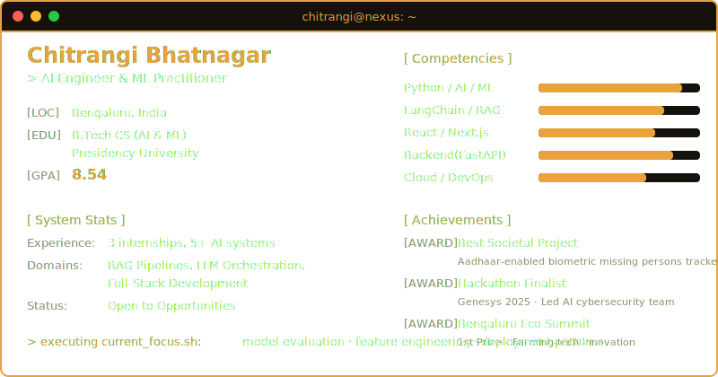

<div align="center">


<br/>


<p align="center">
  <a href="https://www.linkedin.com/in/chitrangi-bhatnagar-2a591b255"></a>
  <a href="mailto:chitrangibhatnagar@gmail.com"></a>
  <a href="https://chitrangibhatnagar.github.io/chitrangi-ai-nexus/"></a>
</p>

</div>

<p align="center">

</p>

<div align="center">

</div>

## 📊 `> github_stats --fetch`

<p align="center">
  
</p>
<p align="center">
  
</p>

<div align="center">

</div>

## 🧑‍💻 `> about_me.sh`

```console
$ whoami
AI Engineer building production LLM systems.

$ currently
• Tech Intern @ TON Technology Services
• B.Tech AI & ML Student @ Presidency University
• Exploring GenAI, System Design, and Production Deployments

$ interests
LLMs | RAG | Backend | Distributed Systems
```

<div align="center">

</div>

## 🛠️ `> tech_stack --list`

<table>
  <tr>
    <td align="center" width="20%"><b>Programming</b></td>
    <td align="center" width="20%"><b>AI / ML</b></td>
    <td align="center" width="20%"><b>Frameworks</b></td>
    <td align="center" width="20%"><b>Cloud / DevOps</b></td>
    <td align="center" width="20%"><b>Databases</b></td>
  </tr>
  <tr>
    <td align="center" valign="top">
      <br/>
      <br/>
      <br/>
      
    </td>
    <td align="center" valign="top">
      <br/>
      <br/>
      <br/>
      <br/>
      
    </td>
    <td align="center" valign="top">
      <br/>
      <br/>
      
    </td>
    <td align="center" valign="top">
      <br/>
      <br/>
      <br/>
      
    </td>
    <td align="center" valign="top">
      <br/>
      <br/>
      
    </td>
  </tr>
</table>

<div align="center">

</div>

## 💼 `> ps -ef | grep experience`

<table>
  <tr>
    <td>
      <h3>Tech Intern @ TON Technology Services</h3>
      <i>Jul 2025 – Present</i><br/>
      
      
      
      
      <br/><br/>
      <ul>
        <li>Deployed LangChain + OpenAI AI sales agent automating lead qualification for <b>2K+ daily enterprise users</b>.</li>
        <li>Built idempotent batch pipeline processing <b>10K daily email verifications</b> with fault-tolerant tracking.</li>
        <li>Reduced system latency <b>25%</b> via FastAPI + Redis query tuning and caching.</li>
        <li>Automated Airflow DAG monitoring across <b>100+ server endpoints</b>, cutting issue response time by <b>40%</b>.</li>
      </ul>
    </td>
  </tr>
  <tr>
    <td>
      <h3>Web Development Intern @ ScanPick Pvt. Ltd.</h3>
      <i>Nov 2024 – Apr 2025</i><br/>
      
      
      
      <br/><br/>
      <ul>
        <li>Improved Core Web Vitals <b>20%</b> for 2K+ clients with code splitting and lazy loading.</li>
        <li>Designed <b>50+ REST APIs</b> with request optimisation, reducing latency by <b>30%</b>.</li>
        <li>Refactored 12+ frontend modules, reducing bounce rate <b>15%</b>.</li>
      </ul>
    </td>
  </tr>
  <tr>
    <td>
      <h3>Software Engineering Intern @ Houzee Pvt. Ltd.</h3>
      <i>Jul 2024 – Aug 2024</i><br/>
      
      
      <br/><br/>
      <ul>
        <li>Shipped 10+ React Native features, improving development velocity <b>30%</b>.</li>
        <li>Raised test coverage from <b>45% → 72%</b> and reduced crash rate by <b>40%</b>.</li>
      </ul>
    </td>
  </tr>
</table>

<div align="center">

</div>

## 🚀 `> ls -la featured_projects/`

<table>
  <tr>
    <td width="50%" valign="top">
      <h3>🛡️ AI Multi-Agent Cybersecurity</h3>
      <p>TensorFlow RL multi-agent framework for cloud threat mitigation. Pinecone-backed RAG pipeline supporting <b>1000+ concurrent threat assessments</b> at <b>99.2% uptime</b>. Cut manual intervention <b>60%</b>, false positives <b>32%</b>.</p>
      
      
      
    </td>
    <td width="50%" valign="top">
      <h3>📡 Biometric Missing Persons Tracker</h3>
      <p>Real-time biometric tracking with facial recognition + GPS on Raspberry Pi. <b>&lt; 5s latency</b>, <b>500+ authorised users</b>, Aadhaar-enabled. <b>Best Societal Project 2024.</b></p>
      
      
      
    </td>
  </tr>
  <tr>
    <td colspan="2" valign="top">
      <h3>🌐 <a href="https://github.com/ChitrangiBhatnagar/chitrangi-ai-nexus">chitrangi-ai-nexus</a> · <a href="https://chitrangibhatnagar.github.io/chitrangi-ai-nexus/">Live →</a></h3>
      <p>Personal portfolio with a custom cyber-themed UI, animated skills carousel, and EmailJS contact form. Deployed on GitHub Pages via CI/CD.</p>
      
      
      
      
    </td>
  </tr>
</table>

<div align="center">

</div>

## 🏆 `> cat awards.log`

<table>
  <tr>
    <td><b>🥇 1st Prize · Bengaluru Eco Summit 2024</b><br/>Farming-tech innovation · 50+ competing teams</td>
    <td><b>🏆 Hackathon Finalist – Genesys 2025</b><br/>Top 4 · led AI cybersecurity team of 5</td>
  </tr>
  <tr>
    <td><b>🌟 Best Societal Project Award 2024</b><br/>Aadhaar-enabled biometric missing persons tracker</td>
    <td><b>🎓 NSS Student Lead 2022–2024</b><br/>Directed 80+ volunteers · 10+ community initiatives</td>
  </tr>
</table>

<div align="center">

</div>

## 📈 `> live_metrics --poll`

<details open>
<summary><b>⏱️ Weekly coding breakdown</b></summary>
<br/>

<!--START_SECTION:waka-->
```text
From: __ To: __

No data yet — connect WakaTime and let the scheduled workflow populate this block.
```
<!--END_SECTION:waka-->
</details>

<br/>

<!--START_SECTION:activity-->
1. 🔄 Activity feed initializing — first scheduled workflow run will populate this list with your latest commits, PRs, issues, and stars.
<!--END_SECTION:activity-->

<div align="center">

</div>

## 🐍 `> contribution_graph --animated`

<picture>
  <source media="(prefers-color-scheme: dark)" srcset="https://raw.githubusercontent.com/ChitrangiBhatnagar/ChitrangiBhatnagar/output/github-contribution-grid-snake-dark.svg?v=2" />
  <source media="(prefers-color-scheme: light)" srcset="https://raw.githubusercontent.com/ChitrangiBhatnagar/ChitrangiBhatnagar/output/github-contribution-grid-snake.svg?v=2" />
  
</picture>

---

<div align="center">

### `> status`
B.Tech CS (AI & ML) · Presidency University · CGPA **8.54** · graduating 2026<br/>
Open to **internship & full-time roles** in AI/ML Engineering, Data Science, or Full-Stack AI

<sub>Last README auto-sync: handled by GitHub Actions on every push · see <code>.github/workflows/update-readme.yml</code></sub>


</div>
