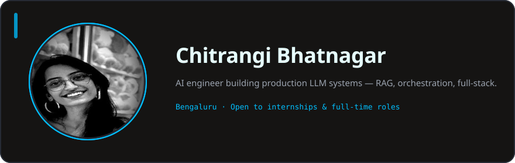
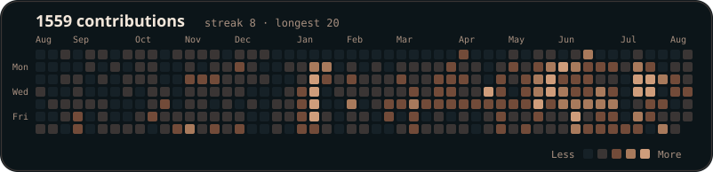
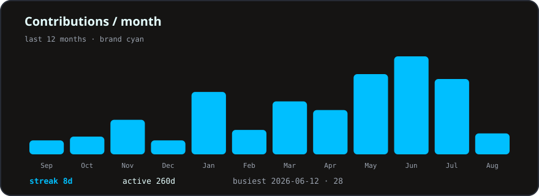
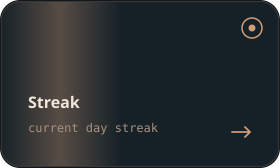
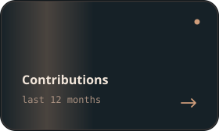
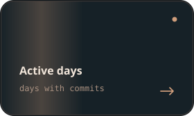
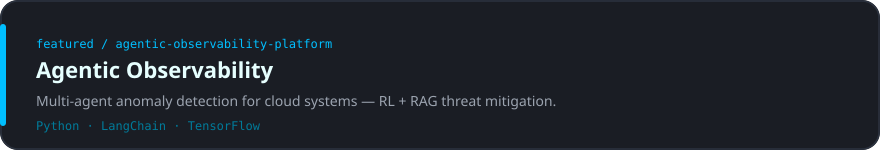
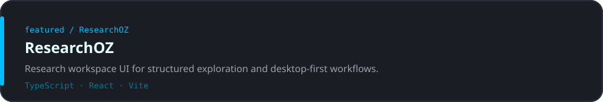

<div align="center">
  
</div>

<div align="center">
  
</div>

<div align="center">
  
</div>

<p align="center">
  <a href="https://github.com/ChitrangiBhatnagar"></a>
  <a href="https://chitrangibhatnagar.github.io/chitrangi-ai-nexus/"></a>
  <a href="https://www.linkedin.com/in/chitrangi-bhatnagar-2a591b255"></a>
</p>

<!-- bento / mosaic project grid -->
<p align="center">
  <a href="https://github.com/ChitrangiBhatnagar/agentic-observability-platform"></a>
  <a href="https://github.com/ChitrangiBhatnagar/ResearchOZ"></a>
</p>

<details>
<summary><b>weekly coding</b></summary>

<!--START_SECTION:waka-->
```text
From: __ To: __

No data yet — connect WakaTime and let the scheduled workflow populate this block.
```
<!--END_SECTION:waka-->

</details>

<!--START_SECTION:activity-->
1. 🔄 Activity feed initializing — first scheduled workflow run will populate this list with your latest commits, PRs, issues, and stars.
<!--END_SECTION:activity-->
